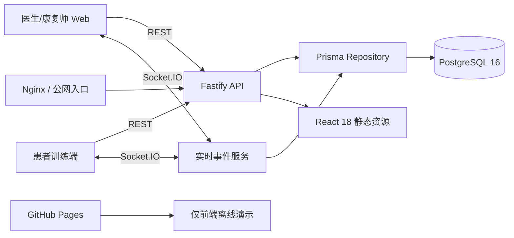
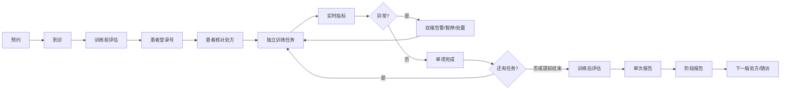
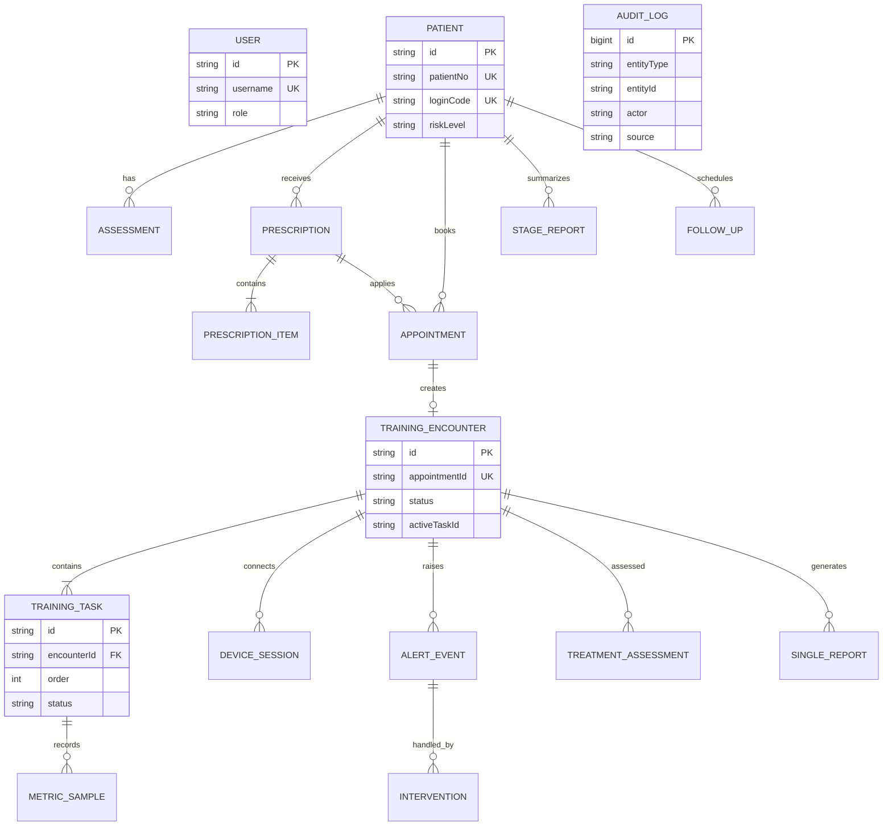

# 心康伴侣全栈架构

## 目标与边界

本项目保留现有 React 原型的交互和视觉，新增 Fastify、PostgreSQL、Prisma 与 Socket.IO。PostgreSQL 是业务事实来源；浏览器 `localStorage` 仅在后端不可用的 GitHub Pages 静态演示中作为降级，不作为全栈模式的数据来源。

当前仍是脱敏调研 Demo。账号密码为演示凭据，未接入医院 SSO、真实设备协议、HIS/EMR 或生产级身份认证，不能用于真实诊疗。

## 系统架构

生产模式由同一 Node 服务提供前端静态资源、`/api` 与 `/socket.io`。开发模式由 Vite 提供页面，并代理 API 和 WebSocket 到 `127.0.0.1:8787`。

## 数据闭环

每个训练项目拥有独立 `TrainingTask.id` 和状态。功率车完成只更新功率车任务，不能通过项目顺序或页面选择状态推断其他项目已完成。

## ER 图

## 状态与一致性

- 预约状态：`pending`、`confirmed`、`arrived`、`in_training`、`completed`、`cancelled`、`no_show`。
- 场次状态：`pre_assessment`、`ready_for_device`、`device_ready`、`in_training`、`paused`、`awaiting_next_task`、`post_assessment`、`pending_signature`、`completed`、`terminated`。
- 任务状态：`pending`、`in_progress`、`completed`、`partially_completed`、`interrupted`、`skipped`。
- 登录号按患者主档固定，设备交接按登录号唯一更新到当前场次。
- 指标通过交接事件即时广播；PostgreSQL 中的指标采样按至少 5 秒间隔及任务结束节点保存，减少高频写入。
- `StateDocument` 是旧原型数据结构的兼容层；每次写入同时同步到规范化业务表。后续可逐模块删除兼容层，不改变现有页面。

## 关键假设

- 同一患者同一时刻只有一个可登录的院内训练场次。
- 登录号仅用于院内设备交接，不等同于患者身份认证凭证。
- AI 只生成建议和摘要，处方发布、异常处置、报告签署仍由有权限的医护人员确认。
- 外部训练视频链接可能受站点防盗链限制；生产环境应上传到自有对象存储或项目视频目录。
