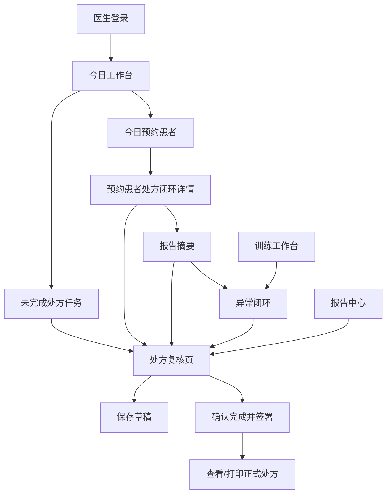

# 心康伴侣医护 Web 端页面原型盘点（当前版）

> 生成时间：2026-07-29  
> 项目目录：`/Users/guagua/Documents/冠心病课题/Codex/心康伴侣-医生调研Demo-v2.1`  
> 本文用途：描述当前医生端/医护 Web 端原型页面现状，供后续逐页调整。  
> 当前产品定位：3 个月医生调研 Demo，不扩展为完整 HIS / EMR / 院级后台系统。

## 0. 当前医生端整体框架

### 0.1 入口与角色

医生端从“双系统入口”进入“医护 Web 端”，随后进入医护登录页。当前预设 3 类账号：

| 角色 | 账号 | 默认权限表达 | 当前可见菜单 |
|---|---|---|---|
| 系统管理员 | `admin` | 全部验证数据、核心后台配置、视频发布/删除、报告打印签名 | 全部业务菜单 + 全部后台菜单 |
| 康复医生 | `doctor.wang` | 团队共享患者、本人的处方任务、临床复核与签署、训练只读 | 今日工作台、处方管理、训练工作台、报告中心、患者档案、视频资源 |
| 康复执行岗 | `rehab.zhou` | 当前康复中心执行、现场记录、基础字段编辑、异常上报 | 今日工作台、训练工作台、报告中心、患者档案、视频资源 |

### 0.2 医护 Web 端通用布局

当前医护 Web 端是典型后台式布局：

- 左侧固定导航栏，宽度约 196px。
- 顶部固定状态栏，显示当前位置、日期时间、当前账号与角色切换。
- 左侧导航分为两组：
  - 业务工作
  - 后台管理
- 底部提示“Demo 权限原型”，强调菜单、操作、数据、字段权限为演示。
- 主内容区域最大宽度约 1540px，整体字体偏小，偏 Web 端管理系统风格。

### 0.3 当前一级菜单

#### 业务工作

1. 今日工作台
2. 处方管理
3. 训练工作台
4. 报告中心

#### 后台管理

1. 患者档案
2. 视频资源
3. 组织权限（仅管理员）
4. 报告打印签名（仅管理员）

---

## 1. 登录页：医护 Web 身份认证

### 页面定位

医护端登录与角色选择页。它不是正式身份认证系统，而是演示不同岗位进入后的菜单和权限边界。

### 页面结构

- 左侧是品牌说明区：
  - “心康伴侣”
  - “医护 Web 身份认证”
  - 强调一个入口按岗位进入不同工作边界。
  - 列出角色权限模板、数据隔离、签署授权审计等能力。
- 右侧是登录操作区：
  - 角色卡片：系统管理员、康复医生、康复执行岗。
  - 账号输入框。
  - 密码输入框。
  - 权限预览卡。
  - 登录按钮。

### 当前交互

- 点击角色卡片会自动切换账号：
  - 管理员：`admin`
  - 医生：`doctor.wang`
  - 康复执行岗：`rehab.zhou`
- 演示密码统一为 `123456`。
- 输入错误时显示红色错误提示。
- 登录成功后进入该角色默认首页。

### 当前优点

- 角色边界清楚。
- 登录前就能看到权限预览，适合调研演示。
- 视觉上比较像 B 端医疗管理系统。

### 需要你确认/可调整点

- 是否保留“角色卡片直接切换账号”的演示方式？
- 是否需要把“医生/康复执行岗/管理员”的权限说明写得更贴近医院真实岗位？
- 是否需要增加“测试账号说明”或“演示数据声明”更明显的位置？

你的调整意见：

-

---

## 2. 通用导航与角色切换

### 页面定位

所有医护 Web 页面的共同壳层。负责显示当前模块、当前角色、数据范围和菜单权限。

### 页面结构

- 左侧导航：
  - Logo：心康伴侣
  - 分组导航：业务工作、后台管理
  - 当前数据范围提示
  - 退出演示工作站
- 顶部栏：
  - 面包屑：心康伴侣 / 业务工作或后台管理 / 当前菜单
  - 当前日期和时间
  - 当前账号和角色
  - 角色切换下拉框
- 顶部提示条：
  - “Demo 权限原型 · 菜单、操作、数据及字段权限同步演示 · 高风险操作需二次确认”

### 当前角色菜单差异

| 菜单 | 管理员 | 医生 | 康复执行岗 |
---|---:|---:|---:|
| 今日工作台 | 可见 | 可见 | 可见 |
| 处方管理 | 可见 | 可见 | 不可见 |
| 训练工作台 | 可见 | 可见 | 可见 |
| 报告中心 | 可见 | 可见 | 可见 |
| 患者档案 | 可见 | 可见 | 可见 |
| 视频资源 | 可见 | 可见 | 可见 |
| 组织权限 | 可见 | 不可见 | 不可见 |
| 报告打印签名 | 可见 | 不可见 | 不可见 |

### 当前交互

- 角色可在右上角下拉切换。
- 切换角色后，不可访问的当前页面会自动跳到该角色可访问的第一个页面。
- 点击左侧菜单切换页面。

### 需要你确认/可调整点

- 医生端是否允许右上角直接切换角色？正式产品不应有，Demo 可以保留。
- “后台管理”是否应该改名为“资源与配置”？现在“患者档案、视频资源”放在后台管理下，有一定争议。
- 康复执行岗是否应该看到“报告中心”？当前是能看到的。

你的调整意见：

-

---

## 3. 今日工作台：医生/管理员视图

### 页面定位

医生进入系统后的首页。当前重点从“全院大屏”调整为“医生今天需要处理什么”。

### 当前页面结构

#### 3.1 顶部标题区

- 管理员显示：“林管理员，上午好”
- 医生显示：“王医生，上午好”
- 医生说明文案：首页只保留今天需要医生决策的预约、报告与处方任务。

#### 3.2 三个顶部指标卡

| 指标 | 当前含义 |
---|---|
| 今日预约患者数 | 今日约到医生处复查/调方的患者数量 |
| 待开具处方数 | 未完成处方总数，细分待生成、待复核、待签名 |
| 异常报告 | 有异常优先标记、会影响调方的报告数量 |

#### 3.3 左侧：今日预约患者

列表字段：

- 姓名
- 分组/风险等级
- 预约时间

点击患者后进入“预约患者处方闭环”详情页。

#### 3.4 右侧：未完成处方任务

当前是医生工作台最核心区域。

筛选项：

- 全部
- 未生成
- 待审核
- 风险分组筛选
- 搜索患者/编号/依据

列表字段：

- 序号
- 患者
- 阶段
- 分组
- 所属医生
- 依据来源
- 状态

点击行：

- 如果状态是“待生成”，会生成 AI 草稿并进入处方页。
- 如果状态是“待审核/待签名”，进入处方页。

### 当前优点

- 比之前大屏式首页更贴近医生真实工作。
- 医生核心任务集中在“报告驱动开处方”。
- 列表比卡片更适合 Web 端高密度工作。

### 当前问题/可调整点

- “所属医生”当前多为 mock 值，真实系统应来自任务责任医生。
- 今日预约和处方任务之间的关联还偏弱；点击预约详情后才看到报告和处方。
- “异常报告”只作为数量和部分详情展示，没有独立列表。

你的调整意见：

-

---

## 4. 今日工作台：预约患者处方闭环详情

### 页面定位

从“今日预约患者”进入，帮助医生围绕某一位患者完成：

患者信息 → 报告依据 → AI 运动参数建议 → 医生确认/签名/打印。

### 页面结构

页面分为 3 列：

#### 左列：患者与报告入口

展示：

- 姓名
- 编号
- 阶段
- 风险

下方有两个报告入口：

- 阶段性报告
- 单次报告

#### 中列：报告摘要

根据选择展示阶段报告或单次报告摘要。

阶段报告摘要包含：

- 医生摘要
- 完成次数
- 靶区达标
- 异常状态
- 患者版说明提醒
- 关联异常：事件、指标、现场处置、医生复核

单次报告摘要包含：

- 运动项目
- 平均心率
- 靶区时间
- 血压
- 血氧
- 安全摘要
- 心电摘要
- 异常闭环

#### 右列：AI 运动参数建议

字段：

- 运动项目
- 频次
- 热身 + 训练 + 放松
- 靶心率
- 功率/阻力
- RPE
- 饮食与注意事项

辅助信息：

- 上一版处方
- AI 建议仅为草稿提示
- 缺失关键数据时禁止确认签名

按钮：

- 生成 AI 草稿
- 医生确认参数
- 数字签名
- 打印最终报告
- 进入完整复核页

### 当前优点

- 这个页面最接近“医生实际调方工作台”。
- 报告、异常、上一处方和新处方在同一屏完成。
- 可以作为后续医生调研重点页面。

### 当前问题/可调整点

- 右侧“AI运动参数建议”与完整处方复核页字段体系不完全一致。
- 打印叫“最终报告”，但实际更像“最终处方报告”，命名可再统一。
- 中列报告摘要是摘要，不是完整报告；是否足够医生调方需要确认。

你的调整意见：

-

---

## 5. 今日工作台：康复执行岗视图

### 页面定位

康复执行岗进入系统后的首页。重点不是开处方，而是当天训练执行、接诊、训练后确认和异常上报。

### 页面结构

#### 顶部指标卡

| 指标 | 当前含义 |
---|---|
| 今日训练计划 | 今日总训练任务 |
| 待接诊 | 已签到/未到诊情况 |
| 在训患者 | 当前训练中的患者 |
| 训练后确认 | 复测与离场确认 |
| 异常待上报 | 训练中胸闷主诉等需要上报的事件 |

#### 下一步执行任务

列表形式展示：

- 时间
- 患者
- 任务
- 状态

示例：

- 陈女士：功率车训练前准备
- 李秀兰：训练后生命体征确认
- 周海明：训练中断后异常上报

#### 执行权限边界

强调：

- 可修改基础资料、生命体征和训练记录
- 可完成训练后确认并上报异常
- 诊断、危险分组和处方字段只读
- 不能复核或签署临床处方

### 当前优点

- 职责边界比医生端清楚。
- 已经弱化正式随访，改为训练后确认/异常上报。

### 当前问题/可调整点

- 这个页面相对简单，缺少“今日训练队列”的细节入口。
- 和“训练工作台”有一定重复，需要确认是否保留两个入口。

你的调整意见：

-

---

## 6. 处方管理：运动处方总台

### 页面定位

医生查看全部处方任务的总入口。与“今日工作台”的区别是：工作台聚焦今日和待办，处方管理聚合全部处方状态。

### 页面结构

顶部标题：

- “运动处方总台”
- 显示未完成数量和已完成数量。

主体分为两列：

#### 左侧：未完成处方

字段：

- 序号
- 患者
- 阶段
- 分组
- 依据
- 状态/操作

操作：

- 待生成：生成草稿
- 待复核/待签名：编辑处方或进入复核页

#### 右侧：已完成处方

字段同左侧。

操作：

- 查看/打印
- 已签署版本不可修改

### 当前优点

- 管理所有处方很直接。
- 未完成和已完成分开，适合医生快速判断待办。

### 当前问题/可调整点

- “确认完成后自动数字签名”这个文案可能不够严谨。真实系统应是医生确认后进入签署动作，不应自动签。
- 与今日工作台的处方列表有重复，但保留总台是合理的。

你的调整意见：

-

---

## 7. 处方复核页：心脏康复中心运动处方

### 页面定位

医生完整编辑、复核、保存、签署和打印运动处方的核心页面。当前已接近“正式文书模板”形态。

### 页面布局

页面为 4 列布局：

1. 病人基础信息
2. AI生成建议
3. 报告列表与报告预览
4. 心脏康复中心运动处方编辑区

### 7.1 病人基础信息

展示：

- 姓名 / 性别 / 年龄
- 分组情况
- 病史
- 诊断
- 特殊用药
- 关键评估缺失提示

### 7.2 AI生成建议

展示：

- 建议：维持功率车为主，靶心率 100-116 次/分钟，总时间 30 分钟/次
- 为什么需要开方
- 上一版参考
- 安全事件与处方影响
- AI 不写入正式处方的提示

### 7.3 报告列表

可切换：

- 阶段性报告
- 单次报告

下方预览报告内容：

- 阶段性报告：完成率、靶区、平均功率、RPE、血压/血氧、心电事件等。
- 单次报告：运动项目、总时长、心率、血压测量点、血氧、心电摘要等。

还有按钮：

- 进入报告中心

### 7.4 处方编辑区

字段按照“心脏康复中心运动处方”模板组织：

#### 基础字段

- 身高
- 联系方式
- 身份证号
- 康复目标

#### 呼吸训练

- 运动方式
- 运动强度
- 运动频率
- 运动时间

#### 热身运动

- 运动方式
- 运动强度（当前固定，不可编辑）
- 运动频率
- 运动时间

#### 有氧运动

- 运动方式
- 运动强度
- 运动频率
- 运动时间

#### 抗阻训练

- 运动方式
- 运动强度
- 运动频率
- 运动时间

#### 柔韧性训练

- 运动方式
- 运动强度
- 运动频率
- 运动时间

#### 备注

- 一段较长的患者可读提醒和运动注意事项。

### 当前操作

- 保存草稿
- 确认完成并签署
- 查看/打印正式处方
- 弹出正式处方预览页

### 当前优点

- 结构接近医生实际要看的运动处方模板。
- 把病史、诊断、特殊用药、上一版处方和异常事件放在处方旁边，调方逻辑更闭环。
- 有打印/签名概念。

### 当前问题/可调整点

- 当前“确认完成并签署”是一个按钮，真实流程可能应拆成“确认处方内容”和“数字签名”两步。
- 页面 4 列信息密度很高，医生端 Web 可以接受，但可能需要优化阅读顺序。
- AI 建议区现在较窄，若医生调研重点是 AI 辅助，可能需要更强的依据展开。
- 正式处方预览中的签名样式和签署人逻辑还可进一步严谨化。

你的调整意见：

-

---

## 8. 训练工作台

### 页面定位

康复执行岗用于查看当天训练任务、设备连接、在训状态和现场记录；医生进入时是观察视图。

### 页面结构

#### 顶部标题

- 康复执行岗：当前康复中心执行视图。
- 医生：医生观察视图，非本人任务匿名。

#### 顶部指标卡

| 指标 | 当前含义 |
---|---|
| 今日计划患者 | 今日训练人数 |
| 已到诊患者 | 到诊情况 |
| 在训患者 | 当前运行中的训练 |
| 已完成训练 | 当天已完成数量 |
| 异常 / 设备提醒 | 当前需要注意的设备或异常 |

#### 左侧：今日训练任务列表

字段：

- 设备 / 患者
- 训练项目
- 当前阶段
- 心率
- 进度
- 到诊 / 状态

康复执行岗可点击“确认到诊”。

医生视图：

- 本人相关任务显示患者姓名和细节。
- 非本人任务脱敏。

#### 右侧：动态设备视图

展示：

- 当前设备
- 当前患者
- 训练阶段
- 进度条
- 实时心率
- 剩余时间
- 实时功率
- 踏频
- 阻力
- 连接状态
- 数据质量提示

#### 右侧下方：异常上报闭环

如果选中患者有关联异常事件，展示：

- 事件时间和类型
- 指标快照
- 现场处置
- 医生复核

#### 现场处置记录

康复执行岗可输入现场处置记录并保存。

医生视图下只读，提示现场记录由康复执行岗完成。

### 当前优点

- 对康复执行岗比较有价值。
- 不提供设备启动/暂停/停止按钮，避免医生端越权控制设备。
- 加入了最小异常闭环。

### 当前问题/可调整点

- 动态设备视图比较像“监控中心”，需要确认医生是否真的需要看。
- 康复执行岗是否需要更多训练前准备入口，例如设备连接详情、血压记录、心理准备状态？
- 现场处置记录保存后当前只是清空输入，没有形成持久可见记录。

你的调整意见：

-

---

## 9. 报告中心

### 页面定位

用于查看单次报告和阶段性报告，并作为医生开具下一版处方的依据。

### 页面结构

顶部是两个 Sheet / Tab：

- 阶段性报告
- 单次报告

### 9.1 阶段性报告列表

左侧列表字段：

- 患者 / 报告
- 日期范围
- 运动内容
- 完成情况
- 靶区
- 状态

右侧阶段结论面板：

- 医生摘要
- 报告类型
- 处方执行
- 靶区达标
- 安全事件
- 点击查看处方版本内容
- 安全事件是否纳入调方依据
- 基于此报告开具处方

### 9.2 阶段报告处方版本弹窗

点击 V1/V2/V3/V4 后弹出“单次处方详情”。

展示：

- 处方版本
- 开具时间
- 开具医生
- 运动项目
- 训练类型
- 频次
- 阶段时长
- 靶心率
- 功率 / RPE
- 诊断建议
- 用药建议
- 康复忌讳
- 饮食注意
- 运动注意
- 停止条件
- 患者可读说明

### 9.3 单次报告列表

字段：

- 患者 / 报告
- 训练时间
- 运动项目
- 运动类型
- 总时长
- 平均心率
- 靶区时间
- 状态 / 查看

点击行进入单次报告详情。

### 9.4 单次报告详情

#### 首屏患者信息

- 患者姓名
- 年龄 / 性别
- 体重 / BMI
- 危险分组
- 病史
- 诊断
- 特殊用药
- Demo 数据提示

#### 实际心率指标

- 静息心率
- 平均心率
- 峰值心率
- 靶区范围
- 靶区时间
- 超靶区时间

#### 实际血压测量

- 训练前血压 + 时间
- 训练中血压 + 时间
- 训练后血压 + 时间
- 明确说明血压为间歇测量，不按连续曲线解释

#### 分期指标

- 心率
- 呼吸率
- 血氧饱和度
- 血压

#### 异常闭环

- 异常类型
- 指标快照
- 现场处置
- 医生复核

#### 处方与执行

- 关联处方版本
- 热身时间
- 训练时间
- 放松时间
- 靶心率
- 运动注意

#### 心电、血氧与处置摘要

- 心电监测摘要
- 血氧摘要
- 心电事件列表：时间、事件、处置、复核

底部按钮：

- 基于本次报告开具处方

### 当前优点

- 单次报告和阶段报告分离清楚。
- 血压没有被画成连续实时曲线，符合医疗逻辑。
- 阶段报告能追溯处方版本，适合解释为什么调方。

### 当前问题/可调整点

- 单次报告详情信息很多，可能需要明确“医生首屏最关注区域”。
- 阶段报告目前右侧是摘要面板，完整阶段报告主要在患者端模板中，医生端可考虑增加更完整表格。
- “基于报告开具处方”的跳转逻辑需要在演示时说明清楚。

你的调整意见：

-

---

## 10. 患者档案

### 页面定位

归在后台管理下，但医生/康复执行岗/管理员都能进入。用于维护患者基本信息与康复档案。

### 页面结构

#### 顶部

- 标题：患者信息与康复档案
- 根据角色显示不同说明：
  - 康复执行岗：基础与执行字段可编辑，诊断/危险分组/处方字段只读或更正申请。
  - 医生：团队医生可新增患者建档，处方/异常/签署仍分派到具体责任人。
  - 管理员：全部患者与字段权限。
- 按钮：新增患者

#### 患者档案列表

字段：

- 患者信息
- 性别/年龄
- 诊断摘要
- 危险分组
- 康复分组
- 当前处方
- 训练状态
- 下次确认
- 操作

支持搜索：

- 姓名
- 编号
- 证件号
- 电话
- 诊断

#### 患者详情

展示：

- 患者编号
- 证件号码
- 联系电话
- 年龄/性别
- 康复分组
- 静息心率
- 诊断摘要
- CPET
- 6MWT

#### 处方历史

展示：

- V4.0 当前执行
- V3.1 已归档
- V2.0 已归档

#### 报告历史

展示：

- 阶段性报告
- 单次报告

#### 最近一次训练摘要

展示最近训练摘要，并有“查看单次报告”按钮。

#### 新增/编辑患者弹窗

字段：

- 患者姓名
- 性别
- 年龄
- 证件号码
- 联系电话
- 危险分组
- 康复分组
- 静息心率
- 训练后确认日期
- 诊断摘要

权限：

- 医生/管理员可编辑诊断摘要和危险分组。
- 康复执行岗诊断摘要和危险分组为只读，提示提交资料更正申请。

### 当前优点

- 已统一 P-DEMO-001 主数据为陈女士。
- 有新增患者入口，符合医生建档诉求。
- 康复执行岗字段权限有体现。

### 当前问题/可调整点

- 患者档案放在“后台管理”下，是否符合医生直觉需要确认。
- “最近一次训练摘要”的查看按钮目前偏展示，是否要真实跳转报告中心可后续增强。
- 档案数据仍是本地 mock，会话刷新后新增/编辑会丢失。

你的调整意见：

-

---

## 11. 视频资源

### 页面定位

后台管理中的训练视频资源库。医生和康复执行岗可维护草稿并提交发布；管理员可发布、下架、删除和永久删除。

### 页面结构

#### 顶部

- 标题：视频资源
- 展示已发布数量和待发布数量
- 根据角色说明权限：
  - 管理员：发布、下架、回收、永久删除
  - 医生/康复执行岗：上传、编辑草稿、提交发布

#### 运动大类切换

横向分类：

- 呼吸训练
- 有氧运动
- 抗阻运动
- 柔韧性运动
- 中医运动

#### 左侧：添加训练视频

可选择：

- 上传本地视频
- 添加 B 站链接

字段：

- 视频名称
- 训练子类型
- 本地文件或 B 站链接

规则：

- 新增内容先保存为草稿
- 草稿提交后进入待发布队列
- B 站链接会提取 BV 号，转换为播放器嵌入地址

#### 左侧：分类视频列表

每条视频展示：

- 视频标题
- 子类型
- 最近维护人
- 状态

状态：

- 草稿
- 待发布
- 已发布
- 已下架
- 回收站

#### 右侧：内容与权限预览

展示：

- 视频预览播放器
- 运动大类
- 训练子类型
- 素材来源
- 最近维护
- 外部链接授权提示

根据状态和权限展示按钮：

- 提交发布
- 审核并发布
- 下架
- 重新上架
- 移入回收站
- 恢复为草稿
- 永久删除

### 当前已发布视频

- 八段锦完整教学
- 腹式呼吸与正念呼吸跟练：腹式呼吸
- 腹式呼吸与正念呼吸跟练：正念呼吸

患者端只会看到 `PUBLISHED` 且有 URL 的视频。

### 当前优点

- 视频发布状态与患者端可见性打通。
- 支持本地上传和 B 站链接嵌入。
- 权限动作比较清楚。

### 当前问题/可调整点

- “视频配置”是否放在后台管理中合理，目前菜单名是“视频资源”。
- 链接白名单只是文案，没有真实白名单配置页。
- 永久删除有二次确认，但没有真实审计列表。

你的调整意见：

-

---

## 12. 组织权限（管理员）

### 页面定位

管理员用于维护验证团队的组织、账号、岗位和权限模板。当前只保留 3 个月验证版最小配置。

### 页面结构

顶部 Sheet：

- 组织账号
- 权限配置

### 12.1 组织账号

左侧：组织边界

- 青岛市心脏康复中心
- 市南院区
- 心脏康复科
- 院内Ⅱ期康复中心

右侧：账号与岗位

字段：

- 姓名
- 岗位角色
- 数据范围
- 所属中心
- 账号状态

账号状态可开关。

### 12.2 权限配置

顶部角色卡：

- 系统管理员
- 康复医生
- 康复执行岗

左侧：操作权限矩阵

动作包括：

- 查看
- 新建
- 编辑
- 复核
- 签署
- 发布
- 下架
- 删除
- 恢复
- 永久删除
- 打印
- 导出
- 授权

管理员模板不可关闭。

右侧：验证版权限口径

展示：

- 菜单范围
- 数据范围
- 患者档案权限
- 视频资源权限
- 签署动作

### 当前优点

- 组织和权限合并为一个页面，符合之前“不要后台太复杂”的要求。
- 不再展开系统接口、数据审计、业务配置等重后台模块。

### 当前问题/可调整点

- “签署动作：管理员可签署本人任务”这个口径还需要临床上再确认，真实系统一般不建议管理员签署临床处方。
- 权限保存只是前端演示，正式系统必须服务端校验。

你的调整意见：

-

---

## 13. 报告打印签名（管理员）

### 页面定位

后台管理中保留的文书闭环配置页，用于支撑报告模板、处方打印模板和数字签名配置。

### 页面结构

顶部：

- 标题：报告打印签名
- 说明：保留处方打印、报告模板和数字签名，支撑医生复核、签署和线下沟通。

主体表格字段：

- 配置名称
- 内容摘要
- 责任方
- 当前状态
- 操作

当前配置：

- 运动处方打印模板
- 单次报告模板
- 阶段报告模板
- 王医生数字签名
- 管理员临床签署授权

### 当前优点

- 只保留和处方闭环最相关的文书配置。
- 没有扩展成大型系统配置后台。

### 当前问题/可调整点

- 管理员临床签署授权需要谨慎，可能会让医生觉得有冒用风险。
- “配置”按钮目前只是展示按钮，没有弹窗详情。
- 如果调研重点是打印处方，建议增加一个模板预览入口。

你的调整意见：

-

---

## 14. 当前医生端关键业务闭环

---

## 15. 当前最值得你优先调整的地方

1. 医生首页是否以“今日预约 + 未完成处方”为主，还是要换成“报告待审核 + 处方待签署”。
2. 处方复核页是否需要保持 4 列高密度布局，还是拆成步骤式。
3. 管理员是否应该具备临床签署能力，还是只能配置签名模板。
4. 患者档案是否继续放在后台管理，还是回到业务工作。
5. 训练工作台对医生是否只保留概览，细节主要给康复执行岗。
6. 报告中心医生端阶段报告是否需要更完整的 V1-V4 表格，而不仅是摘要 + 弹窗。
7. 视频资源的发布/下架/删除权限是否需要在界面上进一步弱化给医生和康复执行岗。

---

## 16. 可直接标注的调整区

### 16.1 菜单调整

-

### 16.2 今日工作台调整

-

### 16.3 处方复核页调整

-

### 16.4 报告中心调整

-

### 16.5 训练工作台调整

-

### 16.6 患者档案调整

-

### 16.7 视频资源调整

-

### 16.8 管理员后台调整

-

